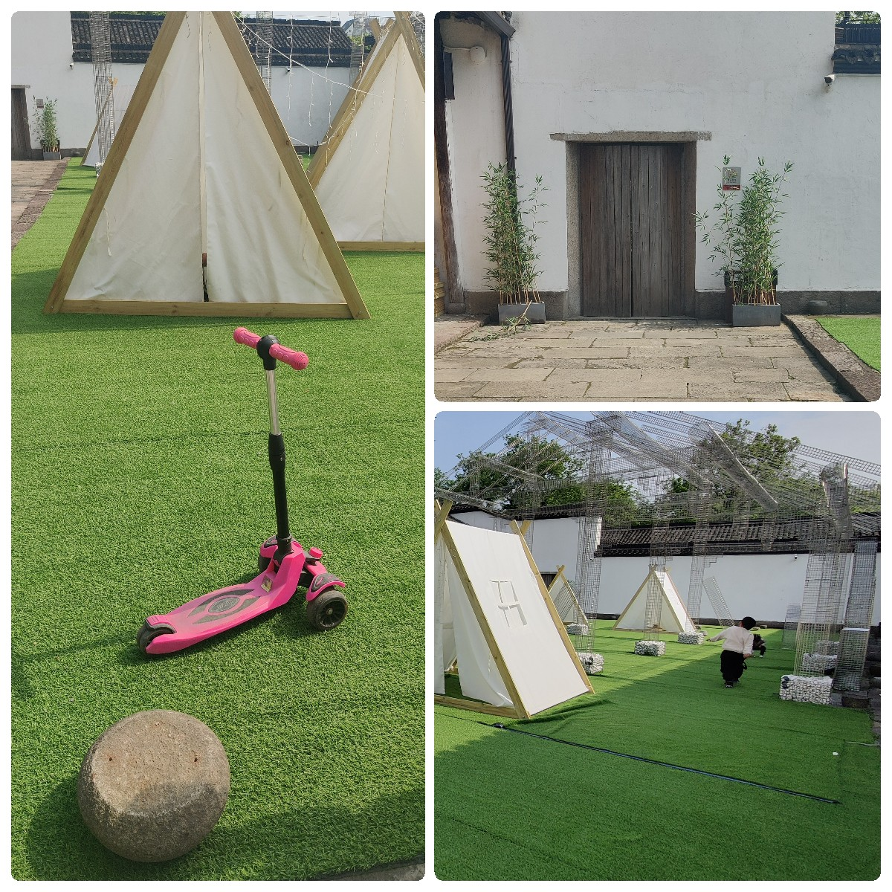

> 舍南舍北皆春水，但见群鸥日日来
<!--more-->

一扫十几日的烟雨绵绵，杭州在清明假期迎来了一个大晴天。我起早吃完早饭，练字结束后洗干净毛笔挂在笔架上，阳光透过白纱帘铺在收拾好的书桌上，笔架踩到一点光斑，在潮湿了几周之后终于可以吐点霉气。我懒洋洋的趴在沙发上拉伸成金枪鱼的姿势，如果说现在有什么事能把我从沙发上挖起来，那就是朋友的这条微信————

    “我下飞机啦！”

时间回到假期前的一周，第无数次因为懒惰放弃出游计划，我把目光放向怂恿朋友来杭出游上：

    朋友：“工作太累了，放假只想瘫着。”

    我：“反正都是瘫着，不如来杭州瘫吧！我给你端茶倒水。”

我相信是端茶倒水打动了朋友，毕竟她随后定了来杭的机票，我开始每天整理家里的一个小角落来缓解期待的心情。

时间回到现在，审判了一圈家里已经干净整洁，带上钥匙出门接驾，

    我：“A1口出！”

    朋友：“累瘫了，你将会看到一个艰难行走的我！”

    我：“待会把你扛在头上跑。”

    朋友：“哈哈哈，海南航空的小饼干不错，3分钟给我你的地址，我要它出现在你的桌子上！”

    我：“......（表面上）使不得，（实际上）地址是xxxxx。”

把朋友 ~~扛回家~~ 领回家，洗漱完后开启girl's night，畅谈中华上下五千年、追星小说看影碟——————其实没有，真实的情况是社畜赶飞机太累了努力聊了点开头随后就被柔软的被子吸引住早早睡下。

好处是在美好睡眠的加成下，第二天我们一早就出发乘坐水上巴士，到武林门码头刷好公交卡上船，顺着京杭大运河下来经过拱宸桥，下船步行，沿着一条有着各种形状窗子的小巷，走到了拐角处

    我：“好像智力题，要你猜猜下一个窗户的图形是什么样。”

    朋友转头一个深得我心的眼神：“我就是这个意思！”

慢慢走到了小河直街，临近博物馆的门前碰到了一对爷爷奶奶，爷爷在给奶奶科普一些博物馆的历史，怀着一些敬重的心听了点墙角，眼看博物馆的人越来越多，赶紧扫码进了门。

匆匆看过一些展品，穿过郁金香花圃，来到一个灯展厅，也许是早上来的缘故，帐篷上的灯架还没搭好，我和朋友溜进帐篷一看，星星点点的光线绕着里边的架子，竹条编的小圆凳里边塞了一个暖橘色的光源，躺在草地上怪可爱的。可惜没有看到晚上的样子，朋友有点遗憾。

从帐篷里出来，发现一个小男孩骑着粉色的单滑板车帅气掠过，正要打开手机看看午饭吃点什么的我吓了一跳，小男孩把车停在角落里，也钻到帐篷里面玩耍；我打开软件和朋友一起挑选午餐，小男孩钻出帐篷，看到举着手机的我，角度正面对着他的滑板车，非常大度的挥挥手：“没事！你拍吧！”

    我：“......”

    朋友：“快给我们单车男孩一个面子，拍吧”

从博物馆出来，沿着小河直街继续走，眼瞅着人越来越多，果断进行下一个行程。地铁加上打车一番折腾后抵达天目山，茑尾书店。穿过入口的咖啡厅，就进入书店区域，书店背景是数米的书墙加一些文创用品，中文书的数量很少，走过一个角落处看到一本醒目的~~格格不入的~~《韭菜的自我修养》，不免的虎躯一震。出了书店转转，跟风在网红面包店前排起了长队，买到了意外好吃的可颂，心满意足的回家。

隔天帮忙朋友收拾买到的文创品，打包好行李出发去机场。朋友执意只要送到地铁口，我无聊的回到家，打开冰箱准备拿瓶汽水，忽然看到朋友藏在冰箱的绿豆糕，起瓶器咔嚓一声扭下来瓶盖，我拿出绿豆糕窝回沙发————

真是个不错的清明假期呀。
