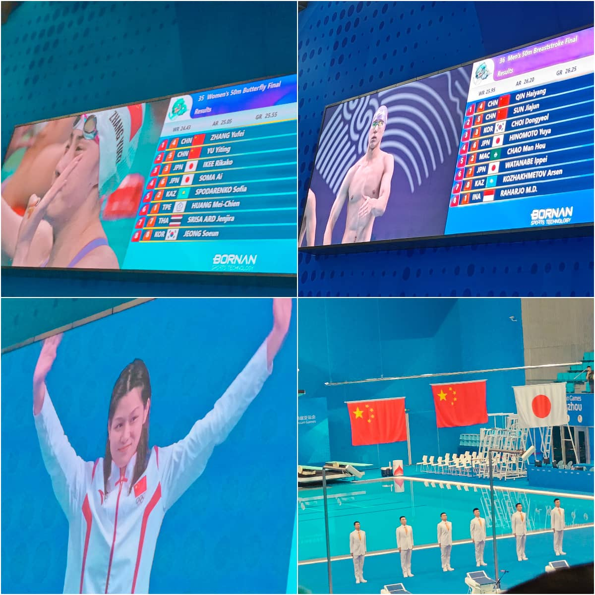

亚运会结束有一段时间，作为大赛型观众，如果不是恰巧在杭州举办，大概也不会千里迢迢奔赴一个陌生的城市看比赛。年中的时候，虽然街道两旁都已经贴上了亚运会标语，冷不丁也会发现红绿灯的小人变成莲莲魔性的微笑；但作为普通市民，大概还是居委会的阿姨拿着喇叭排查人口信息更有亚运就要开始的意味。

9月29日，国庆长假开启的第一天，又是中秋佳节；我买的是游泳晚场19：30的门票（之前抢票的腥风血雨此处不再赘述），正好是决赛外加颁奖典礼。前几天的精准搜索加上大数据推送，这段时间我的手机社交媒体已经充斥了各种赛前攻略，我细心研读了不少plog、vlog，想站在众多网络巨人的肩膀上，这张珍贵的游泳比赛门票我定能发挥出它全部的观赛价值。收拾好随身物品，打扮一番，按照计划的时间出门。地铁扫码进站，当日的乘车码已经自动变成亚运PASS：

「非常好，完美执行第一步！」

奥体中心转C口出门，步行大约五十米就能看到一排的取票机，顺利取出门票后，我正要放回帆布袋里，一个神秘大叔走过来，压低声音：“门票卖吗？”，我警觉的摆摆手，赶紧离开了，一路穿过兜售小红旗和吉祥物的小贩，直奔游泳馆门口

「非常好，完美执行第二步！」

转角后直行到地铁B口，从场馆门口排到地铁口的长队还是给本人一点小小的震撼。因为奥体中心是一整片的场馆群，我心存侥幸的猜测可能是隔壁篮球馆的队伍混入其中了，走到前边去问了下执勤人员：“这个队伍都是游泳馆的观众吗？” 得到肯定答复后，赶紧退回到队尾继续排队，逆行的路上看到已经在队伍中的路人们，电光火石间的四目相对我可以感受出来，我们看的是同一版攻略文章。

「好的，先帝创业未半而中道崩殂了。」

18:00准时开馆，一路经过验票、安检后入场。到了场馆里面，经过小青荷志愿者的引导，领取完手幅、明信片、小旗子。

攻略中，要获得游泳大礼包最难的还是找到sp小青荷，绕了两圈无果之后，我直觉此次希望不大了，靠在一处座位口休息一下；这时候背后突然刷新了一位香港运动员，我一转头恰好碰到，礼貌上前问一下可以合影吗，对方欣然答应，合完照又自然的帮下一位观众拍了一张（顺带学习了一下单反的使用）。这边还在和那位单反观众小小调整了一下照片效果，准备再合一张，转头一看合影的人已经排出一条队伍了，无奈就此作罢。

又转了两圈，看到已经有观众拿着大礼包和我擦肩而过了，绕去服务台一问，果然已经领完。此时距离比赛开始只有半小时，无奈只好去看台落座了。

比赛开始的半小时前，运动员会在场地里面试游，放眼望去泳道上来来回回是各种肤色、人种；此时穿的还是普通的竞速泳衣，试游结束后，运动员会回去冲洗，并换上正式的比赛泳衣，这也是为什么在场馆内和水池都是保持恒温的情况下，后来上场的运动员总穿着羽绒服，从换泳衣到正式比赛期间大约有40分钟的时间，这段时间内要一直保持身体温暖，肌肉放松。

15分钟后开始暖场表演，除了播放杭州民间市歌【千年等一回】，还加了一首中秋限定的【但愿人长久】。坐在我前一排的是一个三口之家，整齐的亲子装外加一大面国旗，小女孩扎着两个包子发髻非常可爱。导播开始宣讲比赛流程结束后，开始赛前抽取幸运观众环节，我听到被拍到的观众同样可以获得游泳大礼包，眼前一亮，一抬头，赫然看见自己的脸在大屏幕上，合理怀疑是前面的一家子太过显眼，顺带把我拍进去了，总而言之是弥补了先前一小时的遗憾。

抽取幸运观众结束后倒数五秒，比赛随后正式开始。解说员开始介绍各国的运动员入场，音乐虽然很浮夸，但是在当时的赛场上还是比较应景。捕捉到有一位00后的小将出场时，听到解说员激动的介绍配合夸张的背景音乐，他拉了拉羽绒服的帽子，浙江是游泳大省，不少国家队员此次都是在家门口比赛，可能也有一些近乡情更怯的意味。

现场观赛是有视频转播无法传达的紧张刺激感。上一秒场馆内还回荡的加油声，下一秒准备的发令声起，全场肃静，随后枪响，运动员瞬间游入水里。短距离的比赛，速度太快，从长划臂出水的一刹那大概就已经奠定比赛结果了。长距离的比赛，裁判员会拿一个巨大的数字牌在池边，提醒运动员这一趟的趟数。值得一提的是中国队女子4X100的接力赛因为上午的抢跳被取消了比赛资格，已经是连续三届同样的失误，决赛时只有香港队参加，前排的小女孩挥舞国旗大喊：香港！这可是你们的主场作战！大家都会心的笑起来。

叶诗文的蛙泳夺冠，池江璃花子重返赛场，大家能看到陨落的天才又能重新站到最高的赛场上，这就是竞技体育的魅力所在。前排的小女孩一边挥旗子一边转头和我说：「雨霏姐姐也太厉害啦。」我点头如捣蒜，但我也明白，对于大赛型观众，很容易因为运动员的夺冠垂直入坑，但是训练带来的伤病、随后的成绩下滑；以竞技体育的残酷，四年后难得能依然保持住冠军的成绩。惊艳的亮相，可能就是运动员最好的时刻了。

比赛结束后，大家徘徊在场馆里久久不愿离开，我找了赛程表当背景板合了张影。然后去服务处领取大礼包，结果被告知礼包已经被领完，只能替换成徽章和限定咖啡包了。不得不说游泳在杭州还是大热的项目，含恨离开。

门口站了两排小青荷目送观众离去，我也准备离开的时候，听到一个红衣爷爷喊着：「Hong Kong」，举着香港的区旗跑向志愿者，一行有不少人，应该是来自香港的旅游团。小青荷热情的挥手，我也在旁边抓拍了这一幕

回到家里时间已经比较晚了，刚好爸爸的视频打来，忍不住叽叽喳喳的和他分享了这次游泳比赛。

「真的有这么好看嘛。」爸爸有点无奈

「好看爱看，下一次举办得在名古屋了，不知道还有没有机会现场看啦！」我急得跳脚

「好好好，要早点休息啊。」爸爸继续无奈

「嗯嗯嗯，我先去休息了，后面还有足球和羽毛球比赛要看」我赶紧附和

「......」爸爸无语

第一次的观看亚运会比赛就到此结束了，我不是体育的狂热粉丝，但是真实的坐在看台上，也很难不为现场的情绪感染。正值中秋，希望你也能「海上生明月 天涯共此时」

