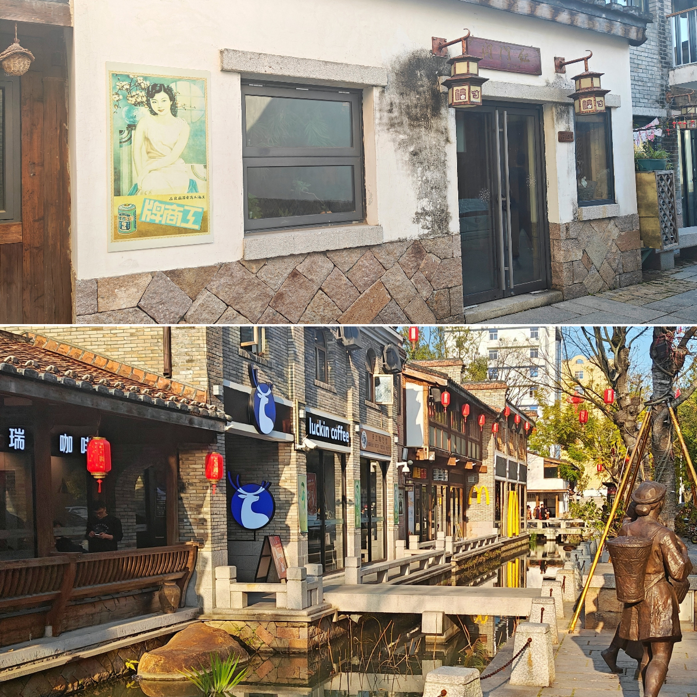



## 除夕夜

后疫情时代第一次回家过年，没想到短短两年已经让我低估了春运的艰难程度，好在热心的同事帮忙抢到了车票，除夕当天风风火火的踏上返乡旅程。

正月天黑的早，晚饭点抵达车站，拖着行李出站后已经是华灯初上。车站门口聚集着各种摩托车司机，我尽量避开他们期冀的目光，赶紧打开叫车软件，勾选上所有车型，预计应答率也只有33%；打车期间有个摩托车司机热情的朝我吆喝，我示意旁边这个半人高的行李箱也是我的，没想到摩托车司机表示完全没问题，离得太远，我不好信达雅地表示出我对他的摩托车结构能放下我这个行李箱的怀疑，赶巧终于有车接单了，我摇摇头朝摩托车司机举起手机指一下，拖着行李箱赶紧走了。

动车站离我家不算远，或者说小城镇没有远的概念，汽车的速度已经完全富余，在县城开车的节奏上就是开始加速的时间点就可以减速了，坐车的距离大概只需要从这个红绿灯到下个红绿灯。就这样经过了一个路口，车在小区楼下停下，我家住在老小区，回来之前有预想老城区不比新区，但是实际看到的时候还是觉得衰败的程度超过我的预想：漆黑的小道、斑驳的墙壁，老鼠兹溜一下从垃圾站掠过；旁边的旧衣回收的收容口吐露出一条深蓝色的毛裤，恐怖的稍作修饰就可以出演案发现场。

我一路默念祷告词回到了家，妈妈开开门，又赶紧跑回厨房；我寻思有大制作？结果她端出一碗年糕表示这就是年夜饭，合理怀疑是在我发消息说快到家之后现成处理的，好在我也爱吃，在家的时候觉得红糖年糕平平无奇，后来在别的城市工作生活，对比下来才觉得家里的年糕甜而不腻实属上上品。我抹抹嘴，说明早想吃锅边，还要配炸的油饼和芋头炸糕，顺带笔画一下三角形表示炸糕。

妈妈：你真的搞笑，大年初一谁给你做锅边。

我：....。

吃完潦草的年夜饭，被安排去铺铺床，妈妈示意我待会再面谈，我察觉要素表示除夕夜还是看看春晚吧，不利于团结的话等过完年再说。她眼看时间是有些晚了，大家各退一步，今日先度过一个平安夜。

## TownWalk

隔天一早我蹑手蹑脚的洗漱好出门，幸运的没有惊动妈妈。一溜烟跑下楼，没走两步就遇上兢兢业业的小贩，大年初一依然有出摊，买个烤红薯边走边吃，先路过一家名字可爱的小吃店，只是这周围的房屋看着岌岌可危的样子

顺着路往下走，经过一个石柱子的时候看到的风俗笑话一则

离家最近的是高中，校门口的小吃店饱经风霜，记得从前在这里吃的时候海报只有简餐，看来现在业务已经拓展到章鱼小丸子了

路过高中的文具书店，拐个弯一直直走就是小学，没想到原来的地址已经变成旅游景区，小学迁移到前面不远处，算是本次回乡看到的第一个魔幻的景象

初中在县体育场隔壁，盘算着走到那还得一段路，投币上了一辆公交车，大年初一车上只有寥寥几人，晃晃悠悠的开着车经过初中校门的时候发现它已经换成另外一个名字，放眼望去教学楼也改了位置，没想到始终如一的只有校门口的文具店。

公交车绕了一圈回到家附件的江滨公园，这一趟逛下来已经到了下午，阳光也好，正适合散步

公园右边的公路旁边露出了奇怪建筑的一角，我在马路牙子边上也只能抓拍到一小点，想要凑近看看是什么用途的，可惜再往前踏一步就是公路了。

## 对谈

正在江滨公园闲逛，收到了敦促我赶紧回家吃饭的消息；到家后看到妈妈已经在准备上菜了，我洗好手装模做样做点调整菜盘的活。妈妈端上最后一盘菜，示意我就坐她右手边，我坐下默默扒拉了两口饭，她先问起了工作，一般到这个环节，我都会照实说，就我的生活经验而言，父母们的想象力有的时候比我掩盖的部分还要夸张，但我也很理解朋友们会把自己的生活粉饰一下汇报给父母，不得不说东亚家长有一种魔力，和他们倾诉烦恼，烦恼加倍，和他们分享喜悦，喜悦减半。

工作没聊两句就结束了这个话题，毕竟她对我的工作内容即不了解，也不好奇，自从经济独立后她也没什么可指摘的地方；随即话锋一转就把问题问到了感情生活上，我无意站在道德的制高点指责她守旧，在这件事上不是我痛苦她就能受益；在她的青年时代，她也曾是不顾父母反对非要走自己的路的人；而现在她不能理解的是，如今的环境条件已经比从前好的多了，我为什么还不能拥有她觉得我应该要有的“幸福”。

我：「首先结婚率低下这是一个既定的事实，因为在过去的年代，即使你贫穷那也是一种踏实的贫穷，你可以预见两年买家电，五年买小车，以一种相对确定的贫困状态在慢慢变好；但现在不一样，现在的富裕也是一种脆弱的富裕，不论是社会还是个人的抗风险能力这个时代都没有更好，不是我们对物质的追求更高，而是我们的责任感更重。其次我们完全明白教育培养的压力，如果无法承担这个责任不如一开始就不担，承担责任又丢掉的破坏性可比主动不担责任大得多，这一点我想你也认同。最后，当然一代人有一代人的追求，在你的年代，很多事情稀里糊涂就发生了，等回过神来已经到人生也就这样的阶段了；但我很清楚，我的幸福很重要，别人的幸福也很重要，如果在一起没有创造更大的幸福，那现阶段还是把自己的事情做好吧。」

妈妈：「那你老了怎么办？」

我转过头看她，从前我不觉得她脸上增多的皱纹有减弱她的威严，但是此时她提到了她担心我而不是她自己老去的问题，这一刻我确实感觉到了她的衰老。

我：「如果确实是孑然一身，那可以考虑社区养老、福利院，不过这也只是现在的社会条件，等到我老的时候可能有更好的形式出现。」

妈妈：「那费用不少吧？」

我：「选择生育成本就低了？人各有志，我完全支持富有忍耐又有恩慈，有觉悟有思想的人去生育培养下一代；不喜欢小孩、没有精力照顾小孩，觉得当不好父母的就不当。」

妈妈：「你不努力一下吗？到时候后悔了怎么办」

我：「这件事上如果需要刻意努力的话还不如不要，如果后悔了那就是我应得的，而且坦白说，会后悔的人不论选什么最后都会后悔的，因为祂总是对另一条路抱有幻想。」

诚然反抗催婚是新时代的政治正确，但这并非是和父母的零和博弈（至少对于我的父母来说），我也并非觉得自己的选择凌驾于他们的选择之上，选择就只是选择而已。真正让我警惕的是一些人真实的困苦，变成了另一些人的调侃，一个时代的期盼变成了另一个时代的消遣，不能说这不正当，但我觉得当中漏过了更要紧的东西。

## 归程

家里蹲了几天，初五一早就收拾行李准备踏上回杭的动车————

妈妈问：「要带点特产回去吗？」

我额头飙出一小滴汗珠：「都要出发了才想起来这事，跟都要火化了再问要不要抢救一下有异曲同工之妙。」

妈妈：「不太吉利，算了确实也没有特产你快走吧。」

从坐动车动笔到现在，拖拖拉拉写了一月有余的老派少女回乡记终于完稿，下次再回大概会是新的一段故事；最后的最后，在外的游子，如果能唤起一点对家的回忆，那也是我的本意之一:-)