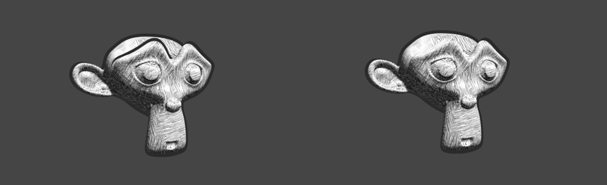

## 前言

之前介绍了非真实感的卡通渲染，提到了Tonal Art Maps/TAM 色调艺术图
<!--more-->


这次我们来实现素描画的效果吧


照例我们还是先放上完整的代码

``` C++
Shader "Kurong/NPR/Sketch"
{
    Properties
    {
        _Color ("Color", Color) = (1,1,1,1)
        _TileFactor ("Tile Factor", Float) = 5
        _Hatch0 ("_Hatch0", 2D) = "white" {}
        _Hatch1 ("_Hatch1", 2D) = "white" {}
        _Hatch2 ("_Hatch2", 2D) = "white" {}
        _Hatch3 ("_Hatch3", 2D) = "white" {}
        _Hatch4 ("_Hatch4", 2D) = "white" {}
        _Hatch5 ("_Hatch5", 2D) = "white" {}
    }
    SubShader
    {
        Tags { "RenderType" = "Opaque" "Queue" = "Geometry" "LightMode" = "ForwardBase" }
        LOD 200
        Pass
        {
            CGPROGRAM
            #pragma multi_compile_fwdbase
            #pragma vertex vert
            #pragma fragment frag
            #include "UnityCG.cginc"
            #include "Lighting.cginc"
            #include "AutoLight.cginc"
            #include "UnityShaderVariables.cginc"

            fixed4 _Color;
            float _TileFactor;
            sampler2D _Hatch0;
            sampler2D _Hatch1;
            sampler2D _Hatch2;
            sampler2D _Hatch3;
            sampler2D _Hatch4;
            sampler2D _Hatch5;

            struct a2v {
                float4 vertex : POSITION;
                float3 normal : NORMAL;
                float4 texcoord : TEXCOORD0;
                float4 tangent : TANGENT;
            };

            struct v2f{
                float4 pos : SV_POSITION;
                float2 uv : TEXCOORD0;
                fixed3 hatchWeight1 : TEXCOORD1;
                fixed3 hatchWeight2 : TEXCOORD2;
                float3 worldPos : TEXCOORD3;
                SHADOW_COORDS(4)
            };

            v2f vert(a2v v){
                v2f o;
                o.pos = UnityObjectToClipPos(v.vertex);
                o.uv = v.texcoord.xy * _TileFactor;
                fixed3 worldLight = normalize(WorldSpaceLightDir(v.vertex));
                fixed3 worldNormal = UnityObjectToWorldNormal(v.normal);
                fixed3 diff = max(0,dot(worldLight,worldNormal));
                float hatchFactor = diff * 7.0;
                o.hatchWeight1 = fixed3(0,0,0);
                o.hatchWeight2 = fixed3(0,0,0);
                //if (hatchFactor > 6.0) {}
                if(hatchFactor > 5.0)
                    o.hatchWeight1.x = hatchFactor - 5.0;
                else if(hatchFactor > 4.0) {
                    o.hatchWeight1.x = hatchFactor - 4.0;
                    o.hatchWeight1.y = 1.0 - o.hatchWeight1.x;
                }
                else if(hatchFactor > 3.0) {
                    o.hatchWeight1.y = hatchFactor - 3.0;
                    o.hatchWeight1.z = 1.0 - o.hatchWeight1.y;
                }
                else if(hatchFactor > 2.0) {
                    o.hatchWeight1.z = hatchFactor - 2.0;
                    o.hatchWeight2.x = 1.0 - o.hatchWeight1.z;
                }
                else if(hatchFactor > 1.0) {
                    o.hatchWeight2.x = hatchFactor - 1.0;
                    o.hatchWeight2.y = 1.0 - o.hatchWeight2.x;
                }
                else{
                    o.hatchWeight2.y = hatchFactor;
                    o.hatchWeight2.z = 1.0 - o.hatchWeight2.y;
                }
                o.worldPos = mul(unity_ObjectToWorld,v.vertex).xyz;
                TRANSFER_SHADOW(o);
                return o;
            }

            fixed4 frag(v2f i) : SV_Target{
                fixed4 hatchText0 = tex2D(_Hatch0,i.uv)*i.hatchWeight1.x;
                fixed4 hatchText1 = tex2D(_Hatch1,i.uv)*i.hatchWeight1.y;
                fixed4 hatchText2 = tex2D(_Hatch2,i.uv)*i.hatchWeight1.z;
                fixed4 hatchText3 = tex2D(_Hatch3,i.uv)*i.hatchWeight2.x;
                fixed4 hatchText4 = tex2D(_Hatch4,i.uv)*i.hatchWeight2.y;
                fixed4 hatchText5 = tex2D(_Hatch5,i.uv)*i.hatchWeight2.z;
                fixed4 whiteColor = fixed4(1,1,1,1)*(1-i.hatchWeight1.x-i.hatchWeight1.y-i.hatchWeight1.z
                -i.hatchWeight2.x-i.hatchWeight2.y-i.hatchWeight2.z);
                fixed4 hatchColor = hatchText0 + hatchText1 + hatchText2 + hatchText3 + hatchText4 + hatchText5 + whiteColor;
                return fixed4(hatchColor.rgb * _Color.rgb, 1.0);
            }
            ENDCG
        }
    }
    FallBack "Diffuse"
}
```

## 重点讲解

### 属性部分

`_TileFactor ("Tile Factor", Float) = 5` ：指的是纹理的平铺系数，系数越大模型上的素描线条就越密

_Hatch0至_Hatch5对应了6张素描纹理图，线条密度依次增大；


`fixed3 hatchWeight1 : TEXCOORD1;`

`fixed3 hatchWeight2 : TEXCOORD2;` 计算6张纹理的混合权重需要6个变量，分别存在2个fixed3的xyz中

### 顶点着色器

`o.uv = v.texcoord.xy * _TileFactor;` 得到纹理的采样坐标

然后计算逐顶点光照，得到漫反射系数 diff 并把 diff 限制在[0,7]之间，得到 hatchFactor

```C++
 fixed3 worldLight = normalize(WorldSpaceLightDir(v.vertex));
 fixed3 worldNormal = UnityObjectToWorldNormal(v.normal);
 fixed3 diff = max(0,dot(worldLight,worldNormal));
 float hatchFactor = diff * 7.0;
 ```

判断 hatchFactor 在[0,7]的7个子区间中的哪一个进行纹理混合权重的计算

```C++
 //if (hatchFactor > 6.0) {}
 if(hatchFactor > 5.0)
     o.hatchWeight1.x = hatchFactor - 5.0;
 else if(hatchFactor > 4.0) {
     o.hatchWeight1.x = hatchFactor - 4.0;
     o.hatchWeight1.y = 1.0 - o.hatchWeight1.x;
 }
 else if(hatchFactor > 3.0) {
     o.hatchWeight1.y = hatchFactor - 3.0;
     o.hatchWeight1.z = 1.0 - o.hatchWeight1.y;
 }
 else if(hatchFactor > 2.0) {
     o.hatchWeight1.z = hatchFactor - 2.0;
     o.hatchWeight2.x = 1.0 - o.hatchWeight1.z;
 }
 else if(hatchFactor > 1.0) {
     o.hatchWeight2.x = hatchFactor - 1.0;
     o.hatchWeight2.y = 1.0 - o.hatchWeight2.x;
 }
 else{
     o.hatchWeight2.y = hatchFactor;
     o.hatchWeight2.z = 1.0 - o.hatchWeight2.y;
 }
```

`o.worldPos = mul(unity_ObjectToWorld,v.vertex).xyz;` 计算顶点的世界坐标

### 片元着色器

将每张纹理进行采样，和上面计算出的权重相乘得到采样的颜色

```c++
 fixed4 hatchText0 = tex2D(_Hatch0,i.uv)*i.hatchWeight1.x;
 fixed4 hatchText1 = tex2D(_Hatch1,i.uv)*i.hatchWeight1.y;
 fixed4 hatchText2 = tex2D(_Hatch2,i.uv)*i.hatchWeight1.z;
 fixed4 hatchText3 = tex2D(_Hatch3,i.uv)*i.hatchWeight2.x;
 fixed4 hatchText4 = tex2D(_Hatch4,i.uv)*i.hatchWeight2.y;
 fixed4 hatchText5 = tex2D(_Hatch5,i.uv)*i.hatchWeight2.z;
```

通过 1 - 6张纹理的权重得到纯白色的贡献度，最后再把白色和计算出的采样颜色进行混合返回最终颜色

```C++
 fixed4 whiteColor = fixed4(1,1,1,1)*(1-i.hatchWeight1.x-i.hatchWeight1.y-i.hatchWeight1.z-i.hatchWeight2.x-i.hatchWeight2.y-i.hatchWeight2.z);
 fixed4 hatchColor = hatchText0 + hatchText1 + hatchText2 + hatchText3 + hatchText4 + hatchText5 + whiteColor;
 return fixed4(hatchColor.rgb * _Color.rgb, 1.0);
```

## 添加描边

因为素描画大多都伴有模型描边，可以添加我们之前写的模型描边的Pass

```C++
Shader "Kurong/NPR/Sketch"
{
    Properties
    {
        _Color ("Color", Color) = (1,1,1,1)
        _TileFactor ("Tile Factor", Float) = 5
        _Hatch0 ("_Hatch0", 2D) = "white" {}
        _Hatch1 ("_Hatch1", 2D) = "white" {}
        _Hatch2 ("_Hatch2", 2D) = "white" {}
        _Hatch3 ("_Hatch3", 2D) = "white" {}
        _Hatch4 ("_Hatch4", 2D) = "white" {}
        _Hatch5 ("_Hatch5", 2D) = "white" {}

        _OutlineRange ("Outline Range", Range(0,0.5)) = 0.1
        _OutlineColor("Outline Color", Color) = (1,1,1,1)
    }
    SubShader
    {
        Tags { "RenderType" = "Opaque" "Queue" = "Geometry" "LightMode" = "ForwardBase" }
        LOD 200
        Pass
        {
            Cull Front
            CGPROGRAM
            #pragma vertex vert
            #pragma fragment frag
            #include "UnityCG.cginc"
            float _OutlineRange;
            float4 _OutlineColor;
            struct a2v
            {
                float4 vertex : POSITION;
            };
            struct v2f
            {
                float4 pos : SV_POSITION;
            };
            v2f vert (a2v v)
            {
                v.vertex.xyz += _OutlineRange * normalize(v.vertex.xyz);
                v2f o;
                o.pos = UnityObjectToClipPos(v.vertex);
                return o;
            }
            fixed4 frag (v2f v) : Color
            {
                return _OutlineColor;
            }
            ENDCG
        }
        Pass
        {
            CGPROGRAM
            #pragma multi_compile_fwdbase
            #pragma vertex vert
            #pragma fragment frag
            #include "UnityCG.cginc"
            #include "Lighting.cginc"
            #include "AutoLight.cginc"
            #include "UnityShaderVariables.cginc"

            fixed4 _Color;
            float _TileFactor;
            sampler2D _Hatch0;
            sampler2D _Hatch1;
            sampler2D _Hatch2;
            sampler2D _Hatch3;
            sampler2D _Hatch4;
            sampler2D _Hatch5;

            struct a2v {
                float4 vertex : POSITION;
                float3 normal : NORMAL;
                float4 texcoord : TEXCOORD0;
                float4 tangent : TANGENT;
            };

            struct v2f{
                float4 pos : SV_POSITION;
                float2 uv : TEXCOORD0;
                fixed3 hatchWeight1 : TEXCOORD1;
                fixed3 hatchWeight2 : TEXCOORD2;
                float3 worldPos : TEXCOORD3;
                SHADOW_COORDS(4)
            };

            v2f vert(a2v v){
                v2f o;
                o.pos = UnityObjectToClipPos(v.vertex);
                o.uv = v.texcoord.xy * _TileFactor;
                fixed3 worldLight = normalize(WorldSpaceLightDir(v.vertex));
                fixed3 worldNormal = UnityObjectToWorldNormal(v.normal);
                fixed3 diff = max(0,dot(worldLight,worldNormal));
                float hatchFactor = diff * 7.0;
                o.hatchWeight1 = fixed3(0,0,0);
                o.hatchWeight2 = fixed3(0,0,0);
                //if (hatchFactor > 6.0) {}
                if(hatchFactor > 5.0) 
                    o.hatchWeight1.x = hatchFactor - 5.0;
                else if(hatchFactor > 4.0) {
                    o.hatchWeight1.x = hatchFactor - 4.0;
                    o.hatchWeight1.y = 1.0 - o.hatchWeight1.x;
                }
                else if(hatchFactor > 3.0) {
                    o.hatchWeight1.y = hatchFactor - 3.0;
                    o.hatchWeight1.z = 1.0 - o.hatchWeight1.y;
                }
                else if(hatchFactor > 2.0) {
                    o.hatchWeight1.z = hatchFactor - 2.0;
                    o.hatchWeight2.x = 1.0 - o.hatchWeight1.z;
                }
                else if(hatchFactor > 1.0) {
                    o.hatchWeight2.x = hatchFactor - 1.0;
                    o.hatchWeight2.y = 1.0 - o.hatchWeight2.x;
                }
                else{
                    o.hatchWeight2.y = hatchFactor;
                    o.hatchWeight2.z = 1.0 - o.hatchWeight2.y;
                }
                o.worldPos = mul(unity_ObjectToWorld,v.vertex).xyz;
                TRANSFER_SHADOW(o);
                return o;
            }

            fixed4 frag(v2f i) : SV_Target{
                fixed4 hatchText0 = tex2D(_Hatch0,i.uv)*i.hatchWeight1.x;
                fixed4 hatchText1 = tex2D(_Hatch1,i.uv)*i.hatchWeight1.y;
                fixed4 hatchText2 = tex2D(_Hatch2,i.uv)*i.hatchWeight1.z;
                fixed4 hatchText3 = tex2D(_Hatch3,i.uv)*i.hatchWeight2.x;
                fixed4 hatchText4 = tex2D(_Hatch4,i.uv)*i.hatchWeight2.y;
                fixed4 hatchText5 = tex2D(_Hatch5,i.uv)*i.hatchWeight2.z;
                fixed4 whiteColor = fixed4(1,1,1,1)*(1-i.hatchWeight1.x-i.hatchWeight1.y-i.hatchWeight1.z
                -i.hatchWeight2.x-i.hatchWeight2.y-i.hatchWeight2.z);
                fixed4 hatchColor = hatchText0 + hatchText1 + hatchText2 + hatchText3 + hatchText4 + hatchText5 + whiteColor;
                return fixed4(hatchColor.rgb * _Color.rgb, 1.0);
            }
            ENDCG
        }
    }
    FallBack "Diffuse"
}
```

效果图如下，注意描边的Pass选择 Cull Front 和 ZWrite Off 的区别

