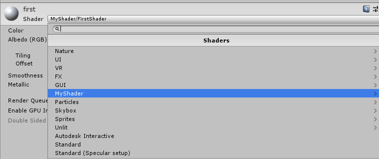

## 新建Shader

首先我们新建一个Shader，这里以 Standard Surface Shader 为例，新建之后我们打开Shader文件应该会出现如下代码：
<!-- more -->

```C++
Shader "Custom/NewSurfaceShader"
{
    Properties
    {
        _Color ("Color", Color) = (1,1,1,1)
        _MainTex ("Albedo (RGB)", 2D) = "white" {}
        _Glossiness ("Smoothness", Range(0,1)) = 0.5
        _Metallic ("Metallic", Range(0,1)) = 0.0
    }
    SubShader
    {
        Tags { "RenderType"="Opaque" }
        LOD 200

        CGPROGRAM
        // Physically based Standard lighting model, and enable shadows on all light types
        #pragma surface surf Standard fullforwardshadows

        // Use shader model 3.0 target, to get nicer looking lighting
        #pragma target 3.0

        sampler2D _MainTex;

        struct Input
        {
            float2 uv_MainTex;
        };

        half _Glossiness;
        half _Metallic;
        fixed4 _Color;

        // Add instancing support for this shader. You need to check 'Enable Instancing' on materials that use the shader.
        // See https://docs.unity3d.com/Manual/GPUInstancing.html for more information about instancing.
        // #pragma instancing_options assumeuniformscaling
        UNITY_INSTANCING_BUFFER_START(Props)
            // put more per-instance properties here
        UNITY_INSTANCING_BUFFER_END(Props)

        void surf (Input IN, inout SurfaceOutputStandard o)
        {
            // Albedo comes from a texture tinted by color
            fixed4 c = tex2D (_MainTex, IN.uv_MainTex) * _Color;
            o.Albedo = c.rgb;
            // Metallic and smoothness come from slider variables
            o.Metallic = _Metallic;
            o.Smoothness = _Glossiness;
            o.Alpha = c.a;
        }
        ENDCG
    }
    FallBack "Diffuse"
}
```

emmm......即使你有编程的基础也可能看的一头雾水，现在就来逐行查看代码。

## 逐行查看

接下来我们讲逐句讲解这个Shader，弄懂每一个语句的意义。

### Shader名称路径

```C++
Shader "Custom/NewSurfaceShader"
```

首先这里标注了Shader的名字和路径，符号 "/" 表示的是创建子层级，我们可以进行修改，例如这里修改为

```C++
Shader "MyShader/FirstShader"
```

我们用这个Shader新建一个材质，可以看见Shader的层级就像我们设置的这样

这里有一个注意点：如果我们把路径名称放在 Hidden下面的话，比如：

```C++
Shader "Hidden/MyShader/FirstShader"
```

则表示在材质面板中隐藏此Shader，你将无法通过材质下拉列表中找到它。这样可以使Shader下拉列表更精简整洁，或者做一些不需暴露的Shader时很有用处。

### Shader属性

```C++
    Properties
    {
        _Color ("Color", Color) = (1,1,1,1)
        _MainTex ("Albedo (RGB)", 2D) = "white" {}
        _Glossiness ("Smoothness", Range(0,1)) = 0.5
        _Metallic ("Metallic", Range(0,1)) = 0.0
    }
```

这里是shader的属性部分：属性的格式写作如下

```C++
[Attribute]_Name ("Display Name",Type) = Default Value
```

- Attribute：属性标记，用于对当前这条属性进行一些特殊的处理，此标记不是必选项，可以不添加，同时一条属性上也可以有多条属性标记。
- _Name：变量名，在之后的Shader代码中都用这个名字来获取该属性的内容，在名称前一定要加**下划线**。
- Display Name：在Unity Inspector上显示的名字，主要起到说明解释的作用。
- Type：类型，可能的type所表示的内容有以下几种：  
- Default Value：上面类型的默认值

#### 属性分类

属性标记|适用类型|举例|作用
:--:|:--:|:--:|:--:|
HDR|Color|[HDR]_Color("Color", Color) = (1,1,0,1)|当给颜色添加了HDR后，则在材质面板中的颜色上会显示HDR的字样，HDR可以使颜色亮度的值超过1，通过这个值可以配合镜头Bloom效果做出物体泛光的视觉效果。
PowerSlider|Range|[PowerSlider(3)]_MyRange("Range",Range(0.0,1.0)) = 0.5|方便用户调节滑杆，例如有个属性值是从0-1,但在大部分情况下所用到的值都是0-0.1，同时需要更精细的在这区间进行微调。一般情况下用户难以控制微调，这个时候就可以利用PowerSlider来解决此问题。
Toggle|Range|[Toggle]_MyRange("Range",Range(0.0,1.0)) =0.5|表示开关，0代表关，1代表开
Enum|Range|[Enum(···)]_MyRange("Range",Range(0.0,1.0)) =0.5|枚举，显示下拉列表
NoScaleOffset|2D|[NoScaleOffset]_MainTex("2D", 2D) = "white" {}|纹理贴图在材质面板中除了显示贴图槽以外默认还会显示两组Float。如果我们不希望用户去调节此参数，我们可以使用[NoScaleOffset]属性标记来将它们隐藏掉。
Normal|2D|[Normal]_MainTex("2D", 2D) = "white" {}|添加[Normal]，来标记此属性是用来接收法线贴图的，当用户指定了非法线的贴图时会在材质面板上进行警告提示
Header|所有|[Header(I am Header)]_MyInt("Int",Int) = 1|在材质面板上进行标注，通常用作分类组别用
HideInInspector|所有|[HideInInspector]_MyInt("Int",Int) = 1|在材质面板中隐藏此条属性，在不希望暴露某条属性时可以快速将其隐藏。

#### 类型分类

类型|说明|语法
:--:|:--:|:--:|
Float|浮点数，注意浮点数值后不需要加后缀f|_MyFloat("Float",Float) = 3.5
Int|整型数|_MyInt("Int",Int) = 1
Range(min,max)|一个介于最小值和最大值之间的浮点数|_MyRange("Range",Range(0.0,1.0)) = 0.5
Color|RGBA（红绿蓝和透明度）四个量来定义的颜色|_MyColor("Color",Color) = (1,1,1,1)
2D|贴图信息|_My2D("2D",2D) = "white"{}
Cube|立方纹理，由6张关联的2D贴图合在一起|_MyCube("Cube",Cube) = "bump"{}
Vector|四维数|_MyVector("Vector",Vector) = (1,2,3,1)

### Shader Tags

Tags用来告诉渲染器：何时以及怎样渲染这个对象。详细内容可以查看[官方文档](https://docs.unity3d.com/Manual/SL-PassTags.html)

```C++
Tags { "RenderType"="Opaque" }
```

标签名称|标签说明|例子
:--:|:--:|:--:|
Queue|控制渲染顺序，保证不透明物体在透明物体之前渲染|Tags {"Queue"="Transparent"}
RenderType|对着色器分类，例如这是渲染透明的，这是渲染不透明的|Tags {"RenderType"="Opaque"}
DisableBatching|是否对该SubShader进行批处理|Tags {"DisableBatching"="True"}
ForceNoShadowCasting|该SubShader是否会投射阴影|Tags {"ForceNoShadowCasting"="True"}
IgnoreProjector|该SubShader是否会Project影响，常用于半透明物体|Tags {"IgnoreProjector"="True"}
CanUseSpriteAtlas|该SubShader用于Sprites时，要设置成false|Tags {"CanUseSpriteAtlas"="False"}
PreviewType|Inspector preview上默认是圆形预设，可以改为plane或者skybox|Tags {"PreviewType"="Plane"}

这里想要着重说一下的是Queue这个标签，如果你使用Unity做过一些透明和不透明物体的混合的话，很可能已经遇到过不透明物体无法呈现在透明物体之后的情况。这种情况很可能是由于Shader的渲染顺序不正确导致的。Queue指定了物体的渲染顺序，预定义的Queue有：

- Background - 最早被调用的渲染，用来渲染天空盒或者背景
- Geometry - 这是默认值，用来渲染非透明物体（普通情况下，场景中的绝大多数物体应该是非透明的）
- AlphaTest - 用来渲染经过Alpha Test的像素，单独为AlphaTest设定一个Queue是出于对效率的考虑
- Transparent - 以从后往前的顺序渲染透明物体
- Overlay - 用来渲染叠加的效果，是渲染的最后阶段（比如镜头光晕等特效）

这些预定义的值本质上是一组定义整数，Background = 1000， Geometry = 2000, AlphaTest = 2450， Transparent = 3000，最后Overlay = 4000。在我们实际设置Queue值时，不仅能使用上面的几个预定义值，我们也可以指定自己的Queue值，写成类似这样："Queue" = "Transparent+100"，表示一个在Transparent之后100的Queue上进行调用。通过调整Queue值，我们可以确保某些物体一定在另一些物体之前或者之后渲染，这个技巧有时候很有用处。

### LOD：Level of Detail

```C++
LOD 200
```

这个数值决定了我们能用什么样的Shader。当设定的LOD小于SubShader所指定的LOD时，这个SubShader就不可以用了。Unity自定义了一组LOD的数值，我们在实现自己的Shader的时候可以参考来设定自己的LOD数值，以便控制渲染。

LOD名称|数值|
:--:|:--:|
VertexLit及其系列|100
Decal, Reflective VertexLit|150
Diffuse |200
Diffuse Detail, Reflective Bumped Unlit, Reflective Bumped VertexLit|250
Bumped, Specular|300
Parallax|500
Parallax Specular|600

### Shader主体代码

终于到了最重要的部分，首先`CGPROGRAM`和`ENDCG`成对出现，表示中间包裹的是一段Cg程序，接着是一个编译指令：

```C++
#pragma surface surf Standard fullforwardshadows
```

意味着我们要写一个表面Shader，并指定了光照模型，具体语法是

```C++
#pragma surface surfaceFunction lightModel [optionalparams]
```

- surface ： 声明的是一个表面着色器
- surfaceFunction ： 着色器代码的方法的名字
- lightModel ： 使用的光照模型。

对应上面的编译指令：我们声明了一个表面着色器，实际的代码在 surf 函数中（在下面的Shader代码能找到该函数），使用 Standard 作为光照模型。接下来是

```C++
sampler2D _MainTex;
```

我们知道在CG中，Texture（贴图）简单来说就是一块内存存储的，使用了RGBA通道，且每个通道8bits的数据。而具体地想知道像素与坐标的对应关系，以及获取这些数据，一次一次去计算内存地址或者偏移显然不可行，因此可以通过sampler2D来对贴图进行操作。一言以蔽之就是，sampler2D是GLSL中的2D贴图的类型，相应的，还有sampler1D，sampler3D，samplerCube等等格式。然后的重点是：为什么在这里需要一句对_MainTex的声明？首先之前我们已经在Properties里声明过它是贴图了

```C++
_MainTex ("Albedo (RGB)", 2D) = "white" {}
```

我们用来实例的这个shader其实是由两个相对独立的块组成的，外层的属性声明，回滚等等是Unity可以直接使用和编译的ShaderLab；而现在我们是在CGPROGRAM...ENDCG这样一个代码块中，这是一段Cg程序。对于这段Cg程序，要想访问在Properties中所定义的变量的话，必须使用**和之前变量相同的名字进行声明**。因此这样做就是再次声明并链接了_MainTex，使得接下来的Cg程序能够使用这个变量。后面的：

- half _Glossiness;
- half _Metallic;
- fixed4 _Color;

都是同样的道理。回到原来的地方，下一句是:

```C++
struct Input {
    float2 uv_MainTex;
};
```

如果你有编程的经历，那么结构体应该很熟悉了，这一段我们结合下面的surf一起来说

#### 表面着色器

先来看 surf 的代码：

```C++
void surf (Input IN, inout SurfaceOutputStandard o)
        {
            // Albedo comes from a texture tinted by color
            fixed4 c = tex2D (_MainTex, IN.uv_MainTex) * _Color;
            o.Albedo = c.rgb;
            // Metallic and smoothness come from slider variables
            o.Metallic = _Metallic;
            o.Smoothness = _Glossiness;
            o.Alpha = c.a;
        }
        ENDCG
```

上文提到的 surf 函数就是对应这一段。我们看函数头输入的参数有Input IN，这个Input就对应上面的结构体。我们可以把所需要参与计算的数据都放到这个Input结构中，再传入surf函数使用；**SurfaceOutputStandard** 是已经定义好了里面类型输出结构。作为输入的结构体**必须命名为Input**，这个结构体中定义了一个float2的变量，你可能会感到奇怪float后面跟着数字，这是什么意思呢？其实float和vec都可以在之后加入一个2到4的数字，来表示被打包在一起的2到4个同类型数。比如：

```C++
float4 color;
float3 multipliedColor = color.rgb * coordinate.x;
```

在这个例子里，我们声明了一个叫做 **uv_MainTex** 的包含两个浮点数的变量。UV mapping 的作用是将一个2D贴图上的点按照一定规则映射到3D模型上，在Cg程序中，我们有这样的约定，在一个贴图变量之前加上uv两个字母，就代表提取它的uv值。我们之后就可以在 surf 程序中直接通过访问uv_MainTex 来取得这张贴图当前需要计算的点的坐标值。接下来我们详细看surf内部的操作：

```C++
fixed4 c = tex2D (_MainTex, IN.uv_MainTex) * _Color;
```

这里用到了一个 tex2D 函数，这是Cg程序中用来在一张贴图中对一个点进行采样的方法，返回一个float4。这个例子中用刚刚得到的 float4 和 _Color 相乘，使得这个贴图经过和颜色混合。

```C++
o.Albedo = c.rgb;
```

将其颜色的rbg值赋予了输出的像素颜色

```C++
o.Metallic = _Metallic;
o.Smoothness = _Glossiness;
```

都是用到上头Properties中我们定义的变量来赋值材质中的 Metallic 和 smoothness

```C++
o.Alpha = c.a;
```

将a值赋予透明度。至此surf介绍完毕，这个例子中shader最重要的部分就是以上这些啦！

#### FallBack

```C++
FallBack "Diffuse"
```

当所有上面的SubShader都不可以在目标平台上运行时，Unity就会调用这个shader，当然你也可以关闭这个选项，那就意味着如果没有显卡可以运行上面的shader，我们也不管它。

## 结语

这是最简单最简单的模板shader，看到这里的你应该可以查看一些简单的shader了，可以去Unity的[Surface Shader Exampless](https://docs.unity3d.com/Manual/SL-SurfaceShaderExamples.html)上查看一些基础shader的编写内容，下一篇我们会开始第一个shader的编写。
