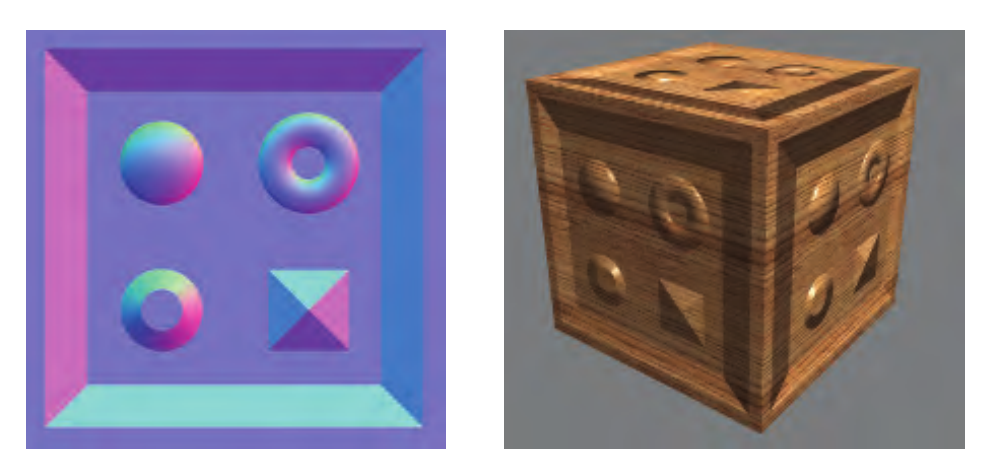
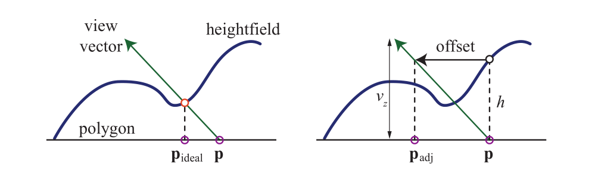

## 前言

上一节我们学习查看了第一个模板Shader，现在我们开始写第一个Shader练练手。首先我们挑一个：**边缘发光效果** 的shader来写，先来看一下效果图：


<!-- more -->
## 实现原理

根据物体表面法向量和视线向量的夹角来判断是否是物体的边缘部位。夹角越大（接近垂直）说明越接近物体边缘部分，**重点：向量点积运算**。

## 具体实现

先放一段实现的代码：

```C++
Shader "Kurong/Rim/RimLightingOpaque"
{
    Properties
    {
        _Color("Color", Color) = (1,1,1,1)
        [Normal]_NormalMap("Normal Map", 2D) = "bump" {}
        _RimColor("Rim Color", Color) = (1,1,1,0.0)
        _RimPower("Rim Power", Range(0.5,6.0)) = 1.0
    }
    SubShader
    {
        Tags { "RenderType" = "Opaque" }
        LOD 200

        CGPROGRAM

        #pragma surface surf Standard fullforwardshadows

        #pragma target 3.0

        fixed4 _Color;
        sampler2D _NormalMap;
        float4 _RimColor;
        float _RimPower;

        struct Input
        {
            float2 uv_NormalMap;
            float3 viewDir;
        };

        void surf(Input IN, inout SurfaceOutputStandard o)
        {
            o.Normal = UnpackNormal(tex2D(_NormalMap, IN.uv_NormalMap));
            o.Albedo = _Color;
            half rim = 1 - saturate(dot(o.Normal,normalize(IN.viewDir)));
            o.Emission = _RimColor.rgb * pow(rim,_RimPower);
        }
        ENDCG
        }
            FallBack "Diffuse"
}
```

如果你看过上一篇的Shader介绍你应该可以大致看懂上面的代码，我们就关键部分说明一下：

```C++
        void surf(Input IN, inout SurfaceOutputStandard o)
        {
            o.Normal = UnpackNormal(tex2D(_NormalMap, IN.uv_NormalMap));
            o.Albedo = _Color;
            half rim = 1 - saturate(dot(o.Normal,normalize(IN.viewDir)));
            o.Emission = _RimColor.rgb * pow(rim,_RimPower);
        }
```

```C++
o.Normal = UnpackNormal(tex2D(_NormalMap, IN.uv_NormalMap));
```

UnpackNormal：是定义在UnityCG.cginc文件中的方法（这个文件中包含了一系列常用的CG变量以及方法，在Unity安装路径中可以找到），接受一个fixed4的输入，并将其转换为所对应的法线值。在解包得到这个值之后，将其赋给输出的Normal，这里如果有疑惑的话可以跳转下面的[拓展知识](#拓展知识)。

```C++
half rim = 1 - saturate(dot(o.Normal,normalize(IN.viewDir)));
```

- normalize 函数：为了对向量进行归一化处理（这里传入 IN.viewDir 指的是 **WorldSpace View Direction**，也就是当前坐标的视角方向）
- dot 函数：返回传入的两个参数的点积
- saturate 函数：判断传入的参数是否在 0-1 之间，如果小于0，返回 0；如果大于 1，返回1

```C++
o.Emission = _RimColor.rgb * pow(rim,_RimPower);
```

- 从 _RimColor 参数获取自发光颜色再和发光的强度混合，最终将颜色赋值给像素的Emission（发散颜色）

## 拓展知识

一般情况下，模型面数越高，可以表现的细节越多，效果就更加真实，与之相应的就是计算量增大，性能下降。为了平衡这两者的矛盾，常常就使用法线贴图来解决，法线贴图就是把法线信息储存在一张图里。使用法线贴图时，通常顶点数和三角形面数只有高精度模型的十分之一不到，因此可以通过低面数模型来模拟高面数模型的效果，增加细节层次感，效果与高模相差不多，但是大大降低了模型的面数。

### 法线贴图的历史

从上古时代来看，最早提出的是凹凸贴图（Bump Mapping），凹凸贴图的思想最早是由图形学届大牛中的大牛 Jim Blinn 提出，后来的 Normal Mapping，Parallax Mapping，Parallax Occulision Mapping，Relief Mapping 等等，均是基于同样的思想，只是考虑得越来越全面，效果也越来越逼真。

#### 凹凸贴图 Bump Mapping

凹凸贴图是指计算机图形学中在三维环境中通过纹理方法来产生表面凹凸不平的视觉效果。它主要的原理是通过改变表面**光照方程**的法线，而不是表面的几何法线，或对每个待渲染的像素在计算照明之前都要加上一个从高度图中找到的扰动，来模拟凹凸不平的视觉特征，如褶皱、波浪等等。

Blinn 于 1978 年提出了凹凸贴图方法。使用凹凸贴图，是为了给光滑的平面，在不增加顶点的情况下，增加一些凹凸的变化。他的原理是通过法向量的变化，来产生光影的变化，从而产生凹凸感，而顶点是没有变换的。表示凹凸效果的另一种方法是使用高度图来修改表面法线的方向。每个单色纹理值代表一个高度，所以在纹理中，白色表示高高度区域，黑色是低高度的区域（反之亦然）。示例如图：


#### 移位贴图 Displacement Mapping

移位贴图，也有人称为置换贴图，或称高度纹理贴图（Heightfield Texturing）。这种方法类似于法线贴图，移位贴图的每一个纹素中存储了一个向量，这个向量代表了对应顶点的位移。注意，此处的纹素并不是与像素一一对应，而是与顶点一一对应，因此，纹理的纹素个数与网格的顶点个数是相等的。在 VS 阶段，获取每个顶点对应的纹素中的位移向量，施加到局部坐标系下的顶点上，然后进行世界视点投影变换即可。

#### 法线贴图 Normal Mapping

法线贴图（Normal mapping）是凸凹贴图（Bump mapping）技术的一种应用，法线贴图有时也称为“Dot3（仿立体）凸凹纹理贴图”。凸凹与纹理贴图通常是在现有的模型法线添加扰动，不同的是，法线贴图要完全更新法线。与凸凹贴图类似的是，它也是用来在不增加多边形的情况下在浓淡效果中添加细节。但是凸凹贴图通常根据一个单独的灰度图像通道进行计算，而法线贴图的数据源图像通常是从更加细致版本的物体得到的多通道图像，即红、绿、蓝通道都是作为一个单独的颜色对待。简单来说，Normal Map 直接将正确的 Normal 值保存到一张纹理中去，那么在使用的时候直接从贴图中取即可。


#### 视差贴图 Parallax Mapping

凹凸贴图和法线贴图的一个问题是，凹凸的部分永远不会随视角移动，也不会相互遮挡。如果你看一个真正的砖墙，你可能看不到砖块间的灰浆. 最好让凸起的效果实际的影响在表面的每个像素点的位置上。视差贴图 Parallax Mapping，又称为 Offset Mapping，以及 virtual displacement mapping，于2001 年由 Kaneko 引入，由 Welsh 进行了改进和推广。视差贴图是通过替换渲染多边形上的顶点处的纹理坐标来实现的，而这个替换依赖于一个关于切线空间中的视角（相对于表面法线的角度）和在该点上的高度图的方程。简单来说，Parallax Mapping 利用 Height Map 进行了近似的 Texture Offset。如图：


#### 浮雕贴图 Relief Mapping

关于浮雕贴图（Relief Mapping），有人把它誉为凹凸贴图的极致。我们知道，Parallax Mapping 是针对 Normal Mapping 的改进，利用 HeightMap 进行了近似的 Texture Offset。而Relief Mapping 是精确的 Texture Offset，所以在表现力上比较完美。


parallax Mapping 能够提供比 Bump Mapping 更多的深度，尤其相比于小视角下，但是如果想提供更深的深度,Parallax Mapping 就无能为力了，Relief Mapping 则可以很好的胜任。相较于Parallax Mapping， Relief Mapping 可以实现更深的凹凸深度。浮雕贴图方法不仅更容易提供更深的深度,还可以做出自阴影和闭塞效果，当然算法也稍稍有点复杂，而如果要用一句话概括 Relief Mapping，将会是：“在 Shader 里做光线追踪”。

### 法线贴图的存储

历史了解一下，然后我们来看一下法线贴图是怎样存储的：我们知道法线贴图中存储的是法线的方向，也就是说是一个Vector3类型的变量，刚好和图片的 RGB 格式不谋而合。但是向量是有方向的，且贴图中只能存储的都是正数，所以还需要一个映射的过程。映射在图形学中的应用很多，比如计算半兰伯特光照时就通过把（0,1）的光照区间转化到了（0.5,1）提高了光的亮度，使效果更好。在法线贴图中，可以用0代表向量中的-1，用255代表向量中的1，不过，在shader中，贴图的颜色一般也是（0,1）区间，所以，我们在计算时只需要把从法线贴图中采样得到的法线值进行映射，将其从（0,1）区间转化到（-1,1）区间。这个步骤，Unity已经为我们完成了，我们在计算法线的时候，只需要调用 UnpackNormal 这个函数就可以实现区间的重新映射。我们在 UnityCG.cginc 中查看 UnpackNormal 的源码：

```C++
inline fixed3 UnpackNormalDXT5nm (fixed4 packednormal)
{
    fixed3 normal;
    normal.xy = packednormal.wy * 2 - 1;
    normal.z = sqrt(1 - saturate(dot(normal.xy, normal.xy)));
    return normal;
}

// Unpack normal as DXT5nm (1, y, 1, x) or BC5 (x, y, 0, 1)
// Note neutral texture like "bump" is (0, 0, 1, 1) to work with both plain RGB normal and DXT5nm/BC5
fixed3 UnpackNormalmapRGorAG(fixed4 packednormal)
{
    // This do the trick
   packednormal.x *= packednormal.w;

    fixed3 normal;
    normal.xy = packednormal.xy * 2 - 1;
    normal.z = sqrt(1 - saturate(dot(normal.xy, normal.xy)));
    return normal;
}
inline fixed3 UnpackNormal(fixed4 packednormal)
{
#if defined(UNITY_NO_DXT5nm)
    return packednormal.xyz * 2 - 1;
#else
    return UnpackNormalmapRGorAG(packednormal);
#endif
}
```

看第一个 UnpackNormal 函数，从函数名来看为了专门解出DXT5nm格式的normal map，这种类型的normal map，只用存储法向量中的两个通道，然后解开的时候，需要计算一下，重新算出另一个向量方向。这样可以实现的原理在于，存储的向量是单位向量，长度一定的情况下，就可以通过 $sqrt(1 - x^2 - y^2)$ 来计算。其他的映射就是简单的乘2减1大法。们经常看到法线贴图是蓝紫色的，这是因为法线经常是朝着Z轴的，也就是(0,0,1)，经过上文的的公式映射后就是(0.5,0.5,1)，因此贴图偏蓝紫色。

我法线贴图中一般都存储的是切线空间，为什么不存储在世界空间或者模型空间。首先看一下世界空间，如果我们的法线贴图存储的世界空间的法线信息，我们可以直接解出法线的值，在世界空间进行计算，是最直接并且计算效率最高的做法，但是世界空间的法线贴图就跟当前环境之间耦合过大了，比如同样的两个模型，仅仅是旋转方向不同，也需要两张法线贴图，这很明显是多余的，于是就有人想出了基于模型空间的法线，基于模型空间，在计算时，把模型空间的法线转换到世界空间，虽然多了一步操作，但是同一个模型可以共用法线，不用考虑旋转等问题。但是，人们感觉模型空间的法线贴图跟模型的耦合度还是高，那就继续解耦吧，于是基于切线空间的法线贴图就诞生了。那么如何按照模型顶点的位置坐标随纹理坐标(u, v)的变化作「切线空间」呢？

$$T = (\frac{\partial x}{\partial u},\frac{\partial y}{\partial u},\frac{\partial z}{\partial u})$$
$$B = N \times T$$
$$T = (\frac{\partial x}{\partial u},\frac{\partial y}{\partial u},\frac{\partial z}{\partial u}) \times (\frac{\partial x}{\partial v},\frac{\partial y}{\partial v},\frac{\partial z}{\partial v}) $$

这就是法线贴图中存储的值。

## 结语

下一次的shader我们将来写 **半透明的边缘发光** 效果。为此在下一篇我们将会先梳理介绍一下Unity shader透明效果的知识。
