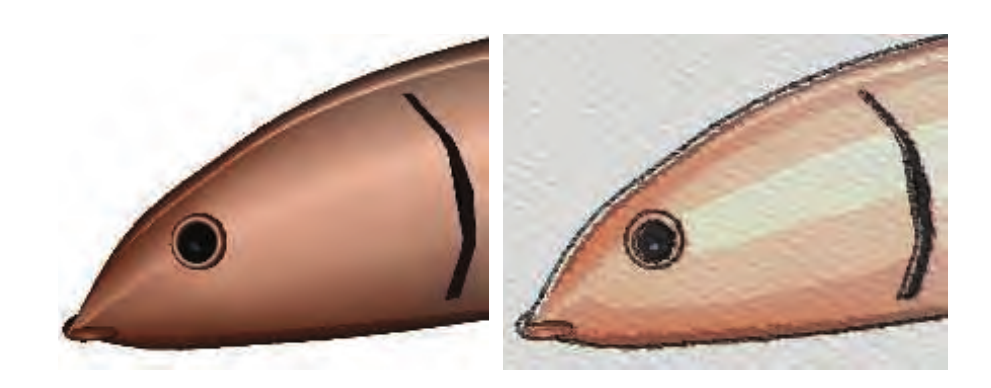

## 前言

非真实感渲染（Non-Photorealistic Rendering，NPR）， 亦被称为风格化渲染（Stylistic Rendering），与传统的追求照片真实感的真实感渲染（Photorealistic Rendering）计算机图形学不同，非真实感渲染旨在模拟艺术式的绘制风格，使用一些渲染方法达到和某些绘画风格相似的效果。
<!--more-->

NPR 的目的之一就是创建类似技术示意图、技术图纸相关的图像，而另一个应用领域便是对绘画风格和自然媒体（如铅笔、钢笔、墨水、木炭、水彩画等）进行模拟。这是一个涉及内容非常之多的应用领域，为了捕捉各种媒体的真实效果，人们已经提出了各种不同的算法。

非真实感渲染与我们并不遥远，它早以“卡通着色（Toon Shading）”的形式出现在各式动漫和电影中。在游戏制作方面，各种涉及到非真实感渲染的作品数不胜数，《Ōkami(大神)》，《The Legend of Zelda（塞尔达传说）》系列，甚至到现在的《Dota2》、《英雄联盟》、《守望先锋》，都多多少少涉及到了 NPR。

## 卡通渲染

上文提到，一直以来，有一种特殊形式的 NPR 倍受关注，且和我们的生活息息相关，那就是卡通渲染（Toon Rendering，又称 Cel Rendering）。这种渲染风格能够给人以独特的感染力与童趣。这种风格很受欢迎的原因之一是 McCloud 的经典著作《Understanding Comics》中所讲述到的“通过简化进行增强（Amplification Through Simplification）”。通过简化并剔除所包含的混杂部分，可以突出于主题相关的信息，而大部分观众都会认同那些用简单风格描绘出来的卡通形象。

在计算机图形学领域，大约在 20 世纪 90 年代就开始使用 toon 渲染风格来实现三维模型和二维的传统动画之间的结合。而且和其他 NPR 风格相比，这种绘制方法比较简单，可以很容易地利用计算机进行自动生成。可以将最卡通着色基本的三个要素概括为：

- 锐利的阴影（Sharp shadows）
- 少有或没有高亮的点（Little or no highlight）
- 对物体轮廓进行描边（Outline around objects）

### 渲染方法

关于 toon 渲染，有很多不同的实现方法。

- 对于含有纹理但没有光照的模型来说，可以通过对纹理进行量化来近似具有实心填充颜色的卡通风格。
- 对于明暗处理，有两种最为常见的方法，一种是用实心颜色填充多边形区域。但这种方式实用价值不大。另一种是使用 2-tone 方法来表示光照效果和阴影区域。也称为硬着色方法（Hard Shading），可以通过将传统光照方程元素重新映射到不同的调色板上来实现。此外，一般用黑色来绘制图形的轮廓，可以达到增强卡通视觉效果的目的。

具体的着色方法，可以理解为在 Fragment shader 中测试每个像素漫反射 diffuse 中的 NdotL 值，让漫反射形成一个阶梯函数，不同的 NdotL 区域对应不同的颜色。下图显示了不同的漫反射强度值的着色部分阶梯指定了不同的像素颜色。

### 轮廓描边

我们在上一节写的模型描边是卡通渲染中一个非常常用的技术，完成描边的算法可以分为以下五种：

- 基于视点方向的描边
- 基于过程几何方法的描边
- 基于图像处理的描边
- 基于轮廓边缘检测的描边
- 混和轮廓描边

#### 基于视点方向的描边

基于视点方向的描边方法，即表面角描边（Surface Angle Silhouetting），其基本思想是使用视点方向（view point）和表面法线（surface normal）之间的点乘结果得到轮廓线信息。如果此点乘结果接近于零，那么可以断定这个表面极大概率是侧向（Edge-on）的视线方向，而我们就将其视做轮廓边缘，进行描边。

#### 基于过程几何方法的描边

基于过程几何方法生成的描边，即过程几何描边（Procedural Geometry Silhouetting），基本思想是先渲染正向表面（frontfaces），再渲染背向表面（backfaces），从而使得轮廓边缘可见，达到描边的目的。有多种方法用来渲染背向表面，且各有优缺点。但它们都是先渲染正向表面，然后打开正向表面裁剪（culling）开关，同时关闭背向裁剪开关。这样这个 pass 中的渲染结果便只会显示出背向表面。一种基于过程几何方法生成的描边的方法是仅仅渲染出背向表面的边界线（而不是面），使用偏置（Biasing）或者其他技术来确保这些线条恰好位于正向表面之前。这样就可以将除轮廓边缘之外的其他所有线条全部隐藏起来。这种方法非常适合单像素宽的线条，但如果线条的宽度超过这个值，那么通常会出现无法连接独立线段的情况，从而造成明显的缝隙。另一种渲染较宽描边线条的方法是直接将背面表面本身渲染成黑色。但没有任何偏置操作，背向表面就会保持不可见，所以需要做的就是通过偏置将这些背向表面沿屏幕 Z 方向向前移动，这样，便只有背向表面的三角形边缘是可见的。如下图，可以使用背向表面的斜率对对多边形进行向前偏置，但是线条宽度依然依赖于正向表面的角度。

#### 基于图像处理的描边

基于图像处理生成轮廓描边（Silhouetting by Image Processing），即通过在各种缓冲区上执行图像处理技术，来实现非真实渲染的方法。可以将其理解为一种后处理操作。通过寻找相邻 Z 缓冲数值的不连续性，就可以确定大多数轮廓线的位置。同样，借助邻接表面法线向量的不连续性，可以确定出分界线（往往也是轮廓线）边缘的位置。此外，利用环境色对场景进行绘制，也可以用来检测前两种方法可能会漏掉的边缘。

#### 基于轮廓边缘检测的描边

上文提到的大多数渲染描边的方法都存在一个缺点，那就是他们都需要两个通道才能完成物体轮廓描边的渲染。基于轮廓边缘检测的描边，通过检测出轮廓边缘（Silhouette Edge Detection）），并直接对它们进行绘制，这种形式的描边，可以很好地控制线条绘制的过程。由于边缘独立于模型，因此这种方法还有另外一个优点就是能够生成一些特殊的效果。例如，在网格密集的地方可以突现出轮廓边缘。可以将轮廓边缘理解为朝向相反的相邻三角形的交接。也就是说，其中的一个三角形是朝向视点，另一个三角形背向视点。具体测试方法如下：
$$( n_0 · v > 0 ) \ne ( n_1 · v > 0 )$$
其中 $n_0$ 和 $n_1$ 分别表示两个三角形的表面法线向量，v 表示从视点到这条边缘（也就是其中任何一个端点）的视线方向向量。而为了确保这种测试的准确性，必须保证表面的取向一致。

#### 混和轮廓描边

混和轮廓描边（Hybrid Silhouetting），即结合了图像处理方法和几何要素方法，来渲染轮廓的方法。这种方法的具体思想是：

- 找到一系列轮廓边缘的列表。其次，渲染出所有物体的三角形和轮廓边缘，同时为他们指定一个不同的 ID 值（也就是说，赋予不同的颜色）。
- 读取该 ID 缓冲器并从中判断出可见的轮廓边缘，随之对这些可见线段进行重叠检测，并将它们连接起来形成平滑的笔划路径。
- 最后就可以对这些重建起来的路径进行风格化笔划渲染，其中，这些笔划本身可以用很多方法来进行风格化处理，包括变细、火焰、摆动、淡化等效果，同时还有深度和距离信息。如下图。

## Palette of Textures 纹理调色板

除了 toon 渲染这种比较受欢迎的模拟风格之外，还存在其他各式各样的风格。NPR 效果涵盖
的范围非常广泛，例如其中的一种：纹理调色板（palette of textures）由 Lake 等人讨论提出，基本思想是通过反射着色项（diffuse shading term）的不同，来选择应用于物体表面上的不同纹理。随着漫反射项逐渐变暗，可以用相应更暗的纹理，而为了能够产生手绘的效果，可以使用屏幕空间坐标来采样纹理。同时，为了增强绘制效果，可以在屏幕空间上的所有表面上运用纸纹理。随着物体的运动，他们就可以在纹理之间进行穿梭。原因在于这个纹理是在屏幕空间中实现的。此外，也可以在世界空间中运用这个纹理，这样就能够得到一个与屏幕空间完全不同的效果。

## Tonal Art Maps/TAM 色调艺术图

通过在纹理之间进行切换形成的硬着色效果和 toon 着色效果之间的一种混合，Praun 等人以实时生成笔划纹理分级细化图的方法，并可以将其以平滑的方式运用到物体表面上。第一步是生成即时使用的纹理，称为色调艺术图（Tonal Art Maps，TAM）,主要思想是将笔划绘制为分级细分图层次，如图。

## Graftals 嫁接

嫁接（Graftals）的基本思想，是将几何或者贴花纹理应用到物体表面，从而产生某种特殊效
果。可以通过所需要的细节层次，物体表面相对视点的方位或者其他因素，对纹理进行控制。这种方法可以用来模拟钢笔或者画刷的笔刷，如下图。

